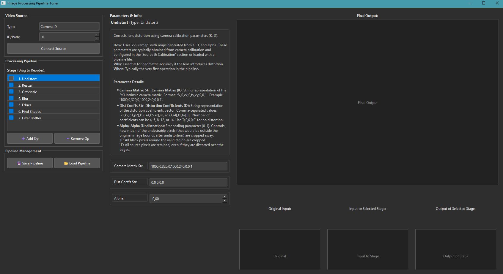

# Image Processing Pipeline Tuner

A real-time, interactive GUI application for building and tuning image processing pipelines using OpenCV and PyQt6. Load video from various sources (camera, file, RTSP), add processing steps, adjust parameters, visualize intermediate results, and save/load pipeline configurations.



## Features

*   **Multiple Video Sources:** Connect to built-in/USB cameras, local video files (MP4, AVI, etc.), or RTSP network streams.
*   **Interactive Pipeline Building:** Add, remove, reorder, enable, and disable image processing operations.
*   **Parameter Tuning:** Adjust operation parameters in real-time using dedicated widgets (spinboxes, sliders, text edits, dropdowns).
*   **Intermediate Visualization:** View the raw input frame, the frame input to the currently selected processing stage, and the frame output from that stage, alongside the final processed output.
*   **Built-in Operations:** Includes common OpenCV operations like Grayscale, Blur (Gaussian, Bilateral), CLAHE, Threshold (Adaptive), Edge Detection (Canny), Contour Finding, Contour Filtering, Morphological Operations, Undistortion, and Resize.
*   **Pipeline Persistence:** Save and load pipeline configurations (including parameters) to/from JSON files.
*   **Real-time Feedback:** See the effects of parameter changes immediately on the processed video stream.

## Setup

1.  **Clone the Repository:**
    ```bash
    git clone <repository-url> # Replace with your repository URL
    cd image-pipeline-tuner
    ```

2.  **Install Dependencies:**
    Make sure you have Python 3.8 or newer installed. Then install the required libraries using pip:
    ```bash
    pip install -r requirements.txt
    ```
    This will install `opencv-python`, `numpy`, `PyQt6`, and `typing-extensions`.

## Usage

1.  **Run the Application:**
    ```bash
    python image_pipeline_tuner.py
    ```
    You can optionally specify a video source directly as a command-line argument:
    *   Camera ID (integer): `python image_pipeline_tuner.py 0` (for the default camera)
    *   Video File Path (string): `python image_pipeline_tuner.py /path/to/your/video.mp4`
    *   RTSP URL (string): `python image_pipeline_tuner.py rtsp://your.stream.url`

2.  **Connect Video Source:**
    In the "Video Source" section on the left, select the source type (Camera ID, Video File, or RTSP Stream), enter the relevant details (ID, path, or URL), and click "Connect Source". The "Final Output" and "Original Input" panels should start showing the video stream.

3.  **Build Your Pipeline:**
    Use the "➕ Add Op" button to add processing steps to the "Processing Pipeline" list. Select an operation type from the dialog. The operation will appear in the list.

4.  **Configure Operations:**
    Click on an operation in the "Processing Pipeline" list to select it. The "Parameters & Info" panel will show the operation's details, explanation, and control widgets for its parameters. Adjust the parameters using the spinboxes, sliders, text fields, or dropdowns. Changes are applied in real-time.

5.  **Manage Pipeline Order and State:**
    *   Drag and drop operations in the "Processing Pipeline" list to change their execution order.
    *   Toggle the checkbox next to an operation in the list to enable or disable it.
    *   Select an operation and click "➖ Remove Op" to remove it from the pipeline.

6.  **Visualize Intermediate Stages:**
    When an operation is selected in the list, the "Input to Selected Stage" and "Output of Selected Stage" panels will show the image data just before and just after that specific operation in the pipeline.

7.  **Save and Load:**
    Use the "💾 Save Pipeline" and "📂 Load Pipeline" buttons in the "Pipeline Management" section to save your current pipeline configuration to a JSON file or load a previously saved one.

## Built-in Operation Details

The application includes common OpenCV operations. The "Parameters & Info" panel provides detailed explanations for each operation and its parameters.

*   Undistort
*   Resize
*   Grayscale
*   Gaussian Blur
*   Bilateral Filter
*   CLAHE
*   Canny Edge
*   Adaptive Threshold
*   Morphological Operation (Erode, Dilate, Open, Close)
*   Hough Circles
*   Find Contours
*   Filter Contours

## Testing

To run the included unit tests:

```bash
python -m unittest test_pipeline.py
```

This will test the utility functions, image operation class, and parameter handling of some processing functions using mocks.

## Contributing

Contributions are welcome! Please open issues or submit pull requests.
